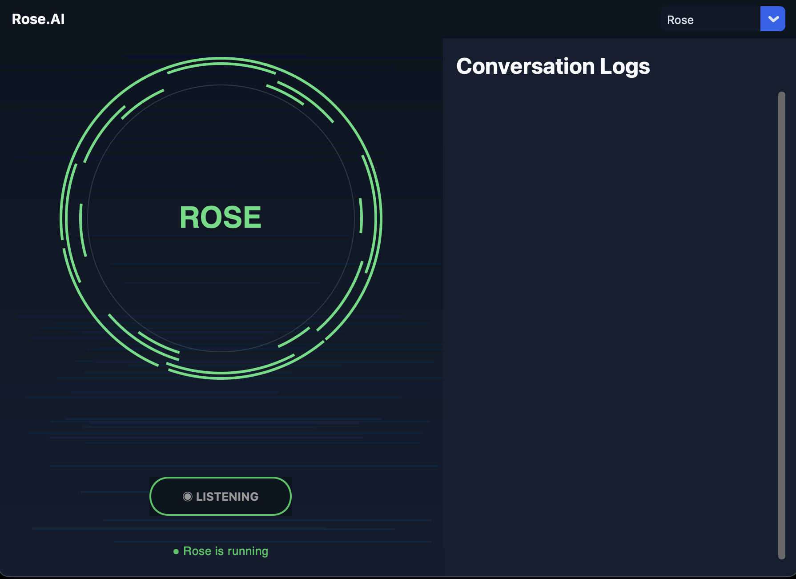

# Rose.AI Assistance

Rose is a personal voice assistant for macOS that listens for a hotkey (or a button press), transcribes what you say, and takes real action — opening apps, managing your calendar, sending messages, searching files, analyzing your screen, and more. It runs quietly in the background and comes with a full settings GUI for configuration, diagnostics, and reviewing conversation history.


## What Rose Can Do

- **Apps & web** — open apps and websites by name, control media playback (Spotify, Apple Music), search specific sites (YouTube, Yelp, Google, and any custom site you add)
- **Calendar** — create, edit, and delete events on Apple Calendar or Google Calendar, using natural corrections like *"actually make that 6pm"*
- **Reminders & notes** — add reminders and notes by voice
- **Messages** — send iMessages by name, with contact disambiguation and a confirmation step before anything sends
- **Files** — find and open files on your Mac by name, even with imprecise phrasing
- **Screen & web content** — take screenshots, describe what's on your screen, or summarize the page you're currently viewing in Chrome
- **General questions** — ask anything, with live web search when needed
- **Long-term memory** — tell Rose to remember facts about you ("remember I go to UCSD"), and she'll bring that context into future conversations
- **Interruptible, natural conversation** — talk over Rose mid-response to interrupt and ask something new, whether triggered by hotkey or the GUI

## Installing Rose

If you just want to use Rose, see [`Rose_Installation_Guide.md`](./Rose_Installation_Guide.md) for step-by-step setup instructions, including how to get past macOS's Gatekeeper warning on first launch.

You'll need:
- An [Anthropic API key](https://console.anthropic.com) (Rose walks you through entering this on first launch)
- macOS, with Microphone, Input Monitoring, and Accessibility permissions granted when prompted

## Project Structure

```
Rose/
├── main.py              # Background hotkey listener (bundled separately as "RoseMain")
├── gui.py                # Settings GUI (bundled as "Rose.app")
├── setup.py               # py2app build config for the GUI
├── core/                  # Shared infrastructure: dispatch, memory, status, pending actions, paths
├── commands/               # Integrations: calendar, messages, files, apps, browser, etc.
├── plugins/                # One plugin per capability - routes Claude's decisions to real actions
├── ai/                     # Claude API calls: routing, event/date parsing, general Q&A
├── vision/                 # Screenshot capture, screen/page analysis, click targeting
├── config/                 # App list, search sites, and other JSON configuration
└── run_tests.py             # Lightweight functional test suite
```

## How It Works

Rose is built around a plugin-based routing system:

1. Your speech is transcribed locally using `faster-whisper`
2. The transcript is sent to Claude (`get_action()`), which decides which **action** applies and extracts any relevant fields (an app name, a recipient, a date, etc.) using structured tool calls
3. `dispatch()` routes the request to the matching **plugin**, which calls the actual integration code and returns a plain-text response
4. The response is spoken aloud via macOS's `say` command

This separation — routing, plugins, and integrations as distinct layers — is what lets new capabilities get added without touching the core dispatch logic.

Rose runs as **two separate processes**:
- `RoseMain` — a background service (via `launchd`) that owns the hotkey and handles voice interactions independent of whether the GUI is open
- `Rose` (the GUI) — a settings and control panel that can start/stop the background service, edit configuration, review conversation history, and also lets you talk to Rose directly via a Speak button

Both communicate through small shared files (status, pending actions, conversation log) so they stay in sync regardless of which one triggered an interaction.

## Development Setup

```bash
python3.12 -m venv venv
source venv/bin/activate
pip3 install -r requirements.txt
```

Create a `.env` file in the project root with your API key:
```
ANTHROPIC_API_KEY=your_key_here
```

Run the GUI or the background listener directly:
```bash
python3 gui.py
python3 main.py
```

## Running Tests

```bash
python3 run_tests.py
```

Or run diagnostics from within the GUI's Diagnostics tab, which streams results live.

## Building a Distributable App

Rose bundles into two pieces — `RoseMain` (PyInstaller) and `Rose.app` (py2app) — which then get combined into one `.app`. See the build commands in `setup.py` and the project's internal build notes for the full sequence, including Tcl/Tk bundling and ad-hoc code signing.

## Known Limitations

- Rose handles one request at a time — compound commands ("open Spotify and check my calendar") aren't yet supported
- The app is ad-hoc signed, not notarized with an Apple Developer ID, so first launch requires bypassing a Gatekeeper warning
- Some features (Reminders, Notes) don't yet support deletion by voice

## License

Personal project — not currently licensed for redistribution.
